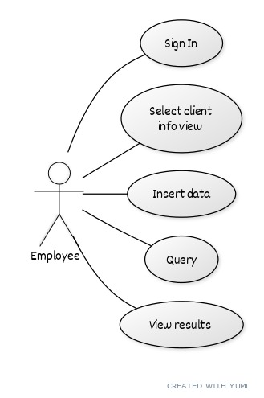
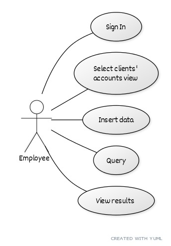
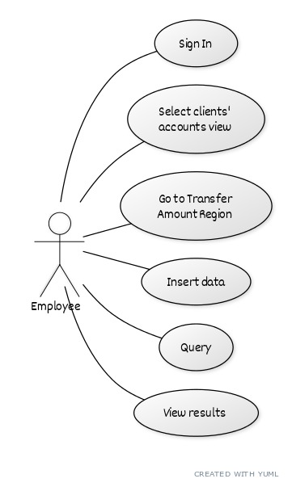
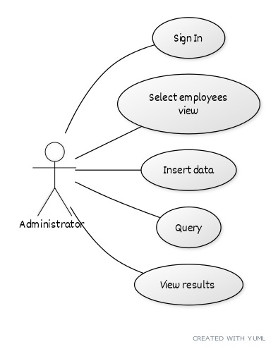
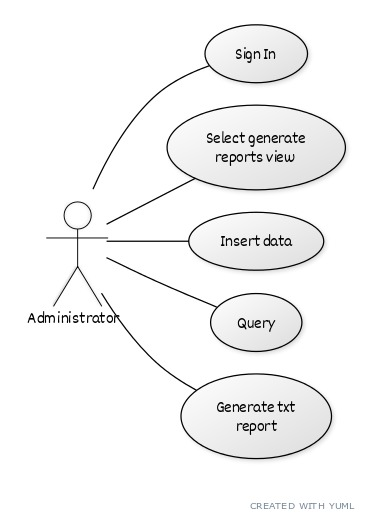
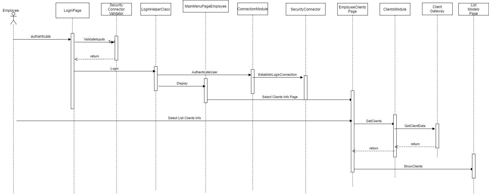
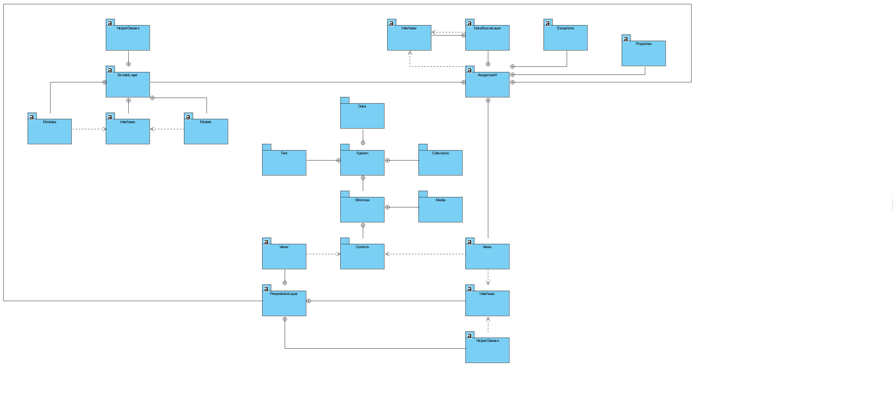
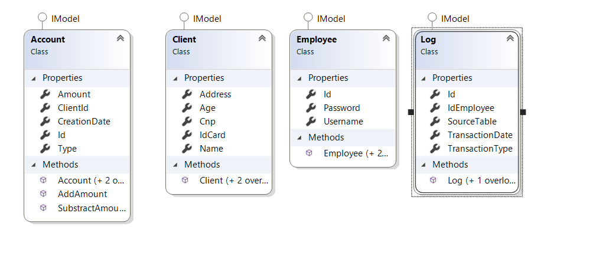

# Analysis and Design Document

# Requirement analysis

## Assignment Specification
The assignment requires to design and implement an application forr the font desk employees of a bank.

## Function requirements
The data will be stored in a database. The Layers architectural pattern is used to organize
the application, using a domain logic pattern and a data source pattern suitable for the application.
The queries should be written agains the database in SQL and no ORM should be used.
Also, SQL scripting is reqquired for creating and populating the database with initial values. 
The inputs of the application will be validated against invalid data before submitting data and saving it in the database. 

## Non-functional Requirements
The regulas user can perform a number of different operations, such as add,update and view client information,
create/update/delete/view client account, transfer money between accounts and process utilities bills.
The administrator can also perform some operations such as: 
create/read/update/delete on eployee's information and generate repotrs for a patricular period containing the activities performed 
by an employee. 

# Use-Case Model

## Use case 1

    * Use case: Regular employee executes CRUD on client informations
    * Level: one of: user-goal level
    * Primary actor: employee
    * Main success scenario: After successfully authenticating the employee completes
    the required fields and queries the informations about clients of the bank
    * Extensions: If the fields are completed accordingly a new table with the results will be generated
    But if the employee inserts invalid data it will be warned about them and no result will appear.

## Use case 2

    * Use case: Regular employee executes CRUD on client's accounts
    * Level: one of: user-goal level
    * Primary actor: employee
    * Main success scenario: After successfully authenticating the employee completes
    the required fields and queries the informations about clients' accounts
    * Extensions: If the fields are completed accordingly a new table with the results will be generated
    But if the employee inserts invalid data it will be warned about them and no result will appear.

## Use case 3

    * Use case: Regular employee transfers money between accounts
    * Level: one of: user-goal level
    * Primary actor: employee
    * Main success scenario: If the 2 accounts have the same currencies and sufficient funds
    the transaction will be executed successfully
    * Extensions: If the accounts have different currencies or there are no enough funds the
    transfer will not be executed

## Use case 4

    * Use case: Regular employee pays utility for a client
    * Level: one of: user-goal level
    * Primary actor: employee
    * Main success scenario: If there are enough funds to complete the transaction it will be executed
    * Extensions: If there are no enough funds or the  account does not exist the transaction will
    not be completed

## Use case 5

    * Use case: Administrator executes CRUD on employees table
    * Level: one of: user-goal level
    * Primary actor: administrator
    * Main success scenario: After authentication is executed the administrator completes the required fields
    and queries the informations on employees' data
    * Extensions: If invalid data is inserted the operation will not be executed

## Use case 6

    * Use case: Administrator generates reports
    * Level: one of: user-goal level
    * Primary actor: administrator
    * Main success scenario: After authentication is executed the administrator inserts the interval of time requested
    to generate the report and a text file with requested data is generated
    * Extensions: If invalid data is inserted the operation will not be executed

# System Architectural Design

## Architectural Pattern Description
##### The 3-Layers Design Pattern:
        Presentation logic is about how to handle the interaction between the user and the software.
    The primary resposibilities of the presentation layer are to display information to the user and
    to interpret commands from the user into actions upon the domain and data source. It is implemented
    using WPF(Windows Presentation Foundation), written in XAML and C#.
        Data Source logic is about communicationg with other systems that carrry out tasks on behalf of the application
    like a database.
        Domain Logic, also known as Business Logic is the work that the application needs to do for the domain
    that you work with. It involves calculations based on inputs and stored data, validation of any data that comes from the
    presentation and figuring out what data source logic to dispatch, depending on commands received from the
    presentation. 
    

## Diagrams
##### Employee Use Case

##### Admin Use Case

# UML Sequence Diagrams

# Class Design

## Design Patterns Description
For organizing the Domain Logic I've used Table module. The difference between Table Module 
and Domain Module is that since both have classes for contracts, products, Table Module has one instance
of contract (from the table) (as a model - designed as a class), designed to work with 
a Record Set, organizing the domain logic around tables. The advantage is that it fits into
the rest of the architecture, WPF being built to work on the results of a SQL query organized as a Record Set 
using a ContextCreator, .NET using this style of development. 
Being a good ideea to seperate SQL access from the domain logic and place it in separate classes 
that should be organized following the structure of the database so that there is one class per database table. 
These classes form a Gateway to the table, and all the SQL that accesses the db is easy to find. 
Many environments provide a record Set, such as DataTable type in C# that is mapped on 
the resulting queried table, so you can hanve only one class for each table in the database. 
The Table Data gateway provides mathods to query the database that return a query. You can also separate.
The fact that Table Data gatewat fits very nicely with Record Set made it obvious for me to 
choose the Table module pattern in the design model.  

## UML Class Diagram

# Data Model

# Bibliography
- [Online diagram drawing software](https://yuml.me/) ([Samples](https://yuml.me/diagram/scruffy/class/samples))
- [Yet another online diagram drawing software](https://www.draw.io)
