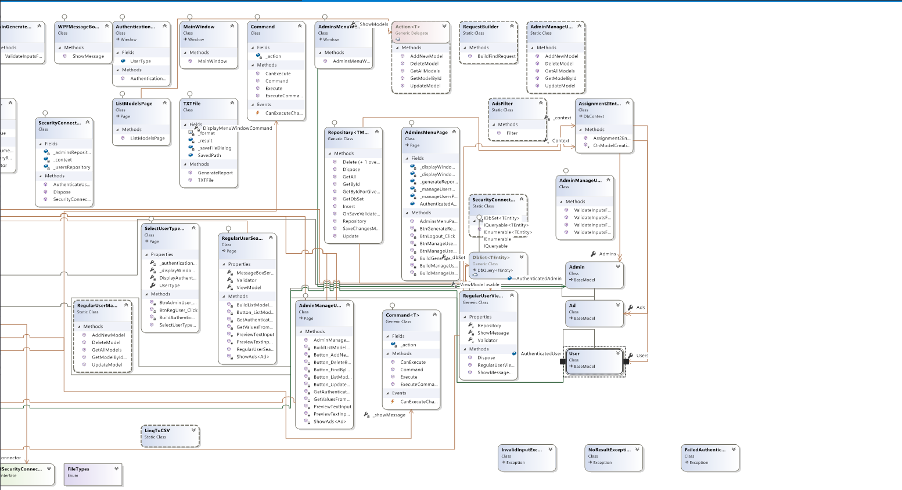

# Property Renting Specification
Design and implement a desktop application for Property Renting. The application should have two types of users (a regular user and an administrator user) which have to provide a username and a password in order to use the application.

# Elaboration – Iteration 1.1

## Domain Model

## Architectural Design

### Conceptual Architecture
The Model View ViewModel (MVVM) is an architectural pattern used in software engineering that originated from Microsoft which is specialized in the Presentation Model design pattern. It is based on the Model-view-controller pattern (MVC), and is targeted at modern UI development platforms (WPF and Silverlight)
VIEW: A View is defined in XAML and should not have any logic in the code-behind. It binds to the view-model by only using data binding.

MODEL: A Model is responsible for exposing data in a way that is easily consumable by WPF. It must implement INotifyPropertyChanged and/or INotifyCollectionChanged as appropriate.

VIEWMODEL: A ViewModel is a model for a view in the application or we can say as abstraction of the view. It exposes data relevant to the view and exposes the behaviors for the views, usually with Commands.

Factory Method is a creational design pattern that provides an interface for creating objects in a superclass, but allows subclasses to alter the type of objects that will be created.The Factory Method pattern suggests that you replace direct object construction calls (using the new operator) with calls to a special factory method. 

### Package Design

### Component and Deployment Diagrams

# Elaboration – Iteration 1.2

## Design Model

### Dynamic Behavior

Sequence Diagram for Regular User Search Ads with Filter

Sequence Diagram for Admin Generate PDF Report

Communication Diagram for Regular User Search Ads with Filter

Communication Diagram for Admin Generate PDF Report

### Class Design
I used MVVM pattern for implemeting the application using WPF for UI and Factory Pattern for generating Ads Reports 

### Data Model

### Unit Testing
For the testing process I used NUnit framework and Moq to mock the data coming from the database, handled in the repository class. In order to mock the data, I had to create a mocking repository that will use the mocked DbSet I sent as a parameter. 
Because DbSet has a privat constructor in EntityFramework, I had  create the mocking data as an array of objects and create a mock of DbSet and then with Setup method I had to set the Provider, Expression, ElementType and GetEnumerator methods with the ones from the sourceList.AsQueryable(); 

I wrote test case scenarios for AdminMangeUsers Page, RegularUserManagePersonAds Page and RegularUserSearchAds Page. 

For each page I tested the case when an admin selects GetAllUsers method, GetModelById, UpdateModel and DeleteModel. 
For RegularUserSearchAds I only have one method, where I mocked the filters for searching an add and then using the mocked data and filters tested if the results were as expected. 

For every method, I had to define a list with the expected data and after calling thhe ViewModels with the mocked repository, verified if the actual and expected results were corresponding.

# Elaboration – Iteration 2

## Architectural Design Refinement

### Conceptual Architecture
The Model View ViewModel (MVVM) is an architectural pattern used in software engineering that originated from Microsoft which is specialized in the Presentation Model design pattern. It is based on the Model-view-controller pattern (MVC), and is targeted at modern UI development platforms (WPF and Silverlight)
VIEW: A View is defined in XAML and should not have any logic in the code-behind. It binds to the view-model by only using data binding.

MODEL: A Model is responsible for exposing data in a way that is easily consumable by WPF. It must implement INotifyPropertyChanged and/or INotifyCollectionChanged as appropriate.

VIEWMODEL: A ViewModel is a model for a view in the application or we can say as abstraction of the view. It exposes data relevant to the view and exposes the behaviors for the views, usually with Commands.

Factory Method is a creational design pattern that provides an interface for creating objects in a superclass, but allows subclasses to alter the type of objects that will be created.The Factory Method pattern suggests that you replace direct object construction calls (using the new operator) with calls to a special factory method. 

Command pattern is a data driven design pattern and falls under behavioral pattern category. A request is wrapped under an object as command and passed to invoker object. Invoker object looks for the appropriate object which can handle this command and passes the command to the corresponding object which executes the command.
The Command pattern is pretty common in C# code. Most often it’s used as an alternative for callbacks to parameterizing UI elements with actions. 

### Package Diagram
Package diagram, shows the arrangement and organization of model elements in middle to large scale project. Package diagram can show both structure and dependencies between sub-systems or modules, showing different views of a system, for example, as multi-layered (aka multi-tiered) application - multi-layered application model.

#### Server

#### Client

### Deployment Diagram
A deplyment diafram shows the structure of the run-time system, capturing the hardware that will be used to implement the system and the links between different items of hardware, modeling the physical hardware elements and the communication paths between them.

### Component Diagram
A component diagram breaks down the actual system under development into various high levels of functionality. Each component is responsible for one clear aim within the entire system and only interacts with other essential elements on a need-to-know basis.

## Design Model Refinement

### Models
The models are generated using Entity Framework Database First, meaning that they are generated from the tables created in sql. They are generated in a Class Libray project, with references to both the Client and the Server side so they can be accessed from everywhere and not written twice.

### Server
On the server side, the most important part is accessing data from the database. This is made via the generic repository where all the operations of accessing the database are implemented. 
In order to comply with SOLID principles, the Protected variations(GRASP) principle, that sugests to protect elements from variations on other elements, the interface was defined generic, where TModel is a BaseClass. Each model in the application inherits from the BaseClass, which also implements the IModel interface in order to "mark" the models, knowing that only the classes that inherit from that Base is a model in the application. This also helps in the "connection" classes from the server side, because there is where I get the requests from the server and I have to use the repository, defining it as IRepository<IModel>, avoiding high coupling. 

The next diagrams represent the handlers on the server side, meaning this are the classes that, with the data received from the client side, compute the result. This classes should only make the operations that are requested, not depending on what data is arriiving, they need to process them and using the repository get or send data to the database, and then return a result. Also, this is where exceptions are thrown if something unpredicted happens.

Next, the ActionConnection classes are just some intermediate classes. In this classes, based on the content received in the message from the client, after the request type was already checked and it is known what kind of operation(Admin manage Users, or Regular User Manage ads etc) will be executed, this is the one that calls the method from the handler(delete, read, update etc) They know what handler to use because it was set in the Connection class.

In the Connection class, the messages from the client are processed, they are deserialized and then the required action is executed, and if there is a result that needs to be sent back, it is serialized and sent to the client. 

### Client
After separating the project in Client and Server, the viewmodels now will not perform the operations with the database, they will only receive the data from the view and will forward the request to the server through some helper classes, that sends and receives messages to and from the server. Also, first thing they do is check if the validation result from the validation made in the view is valid, and if not, they will throw an exception

Next will be presented the classes for each main operation, with the pages they use, auxiliary classes and interfaces

Following are the menu pages for an admin and a user

Next, it is presented the authentication

Finally, these are helper classes used throughout the application, like custom exceptions, a service used in the viewmodel to display messages,
RequestBuilder class that builds the request that has to be sent to the server, a ValidationResult class that has two properties, a bool and a messages, and is used when validating the data enterd by a user in the ui.

In order to comply with the SOLID principles, the command pattern is used. It is a behavioral design pattern in which an object is used to encapsulate all information needed to perform an action or trigger an event at a later time. A command object is used to delegate the action of displaying a window after logging in and the correct credentials were inserted, or from the window were the user type is selected to the authentication window.

# Construction and Transition

## Future improvements
A future improvement would be to migrate the desktop app to Web. One of the advantages is that the user doesn't have to download anything. If designed correctly, the website then can be built to be mobile compatible - for any operating system or device.

# Bibliography
- [Architectural Styles](https://docs.microsoft.com/en-us/azure/architecture/guide/architecture-styles/)
- [Architectural Patterns and Styles](https://msdn.microsoft.com/en-us/library/ee658117.aspx)
- [Design Patterns](https://sourcemaking.com/design_patterns)
- [Online diagram drawing software](https://yuml.me/) ([Samples](https://yuml.me/diagram/scruffy/class/samples))
- [Yet another online diagram drawing software](https://www.draw.io)
