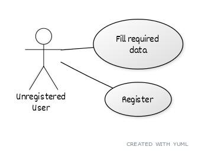

# Property Renting Use Case Model

# Use-Cases Identification

## Use case 1
* **Use case**: Register an account
* **Level**: user-goal level
* **Primary actor**: Unregistered user
* **Main success scenario**: the user successfully completes the required fields then submits the data and is registered within the database, and the next time he uses the application he can login
* **Extensions**: If the fields are completed acordingly he will be registered with success, else, if one of the fields is completed wrong, 
the registration fails

## Use case 2
* **Use case**: User searches ads
* **Level**: one of: user-goal level
* **Primary actor**: Registered user
* **Main success scenario**: after authenticating within the application, te user can now search ads listed by other users and is able too filter them by different properties(e.g. location, size, price)
* **Extensions**: if there are listed ads that fulfill the requirements of the user they will be listed and he can navigate through them, if no ad fulfills his requirements there will be no ad to show

## Use case 3
* **Use case**: User executes CRUD on his ads
* **Level**: one of: user-goal level
* **Primary actor**: Registered user
* **Main success scenario**: User executes the operation successfully
* **Extensions**: if during one of the CRUD operations wrong data is inserted the operation will not execute, else it will execute

## Use case 4
* **Use case**: Administrator performs CRUD on any user's ads
* **Level**: user-goal level
* **Primary actor**: administrator
* **Main success scenario**: Being authenticated as an administrator means you have access to every user's ads and gives you the ability to perform CRUD operations on them filtering by predefined properies.
* **Extensions**: if during one of the CRUD operations wrong data is inserted the operation will not execute, else it will execute

## Use case 5
* **Use case**: Administrator performs CRUD on any users' regular information
* **Level**: user-goal level
* **Primary actor**: administrator
* **Main success scenario**: Being authenticated as an administrator means you have access to every users' regular information and gives you the ability to perform CRUD operations on them filtering by predefined properties.
* **Extensions**: if wrong data is inserted when executing CRUD on the ads no information will be displayed, else it will be listed

## Use case 6
* **Use case**: Administrator generates report files
* **Level**: user-goal level
* **Primary actor**: administrator
* **Main success scenario**: Being authenticated as an administrator means you can generate two types of report files, one in pdf and one in txt or html format with regular user's ads. The reports need to be saved ina user-selected location. 
* **Extensions**: if there is no memory in the selected location or the location is forbidden the reports will not be saved, else they will be saved

# UML Use-Case Diagrams

## Diagram 1

## Diagram 2

## Diagram 3

## Diagram 4

## Diagram 5

## Diagram 6

# Bibliography

* [Online diagram drawing software](https://yuml.me/) ([Samples](https://yuml.me/diagram/nofunky/usecase/samples))
* [Yet another online diagram drawing software](https://www.draw.io)
